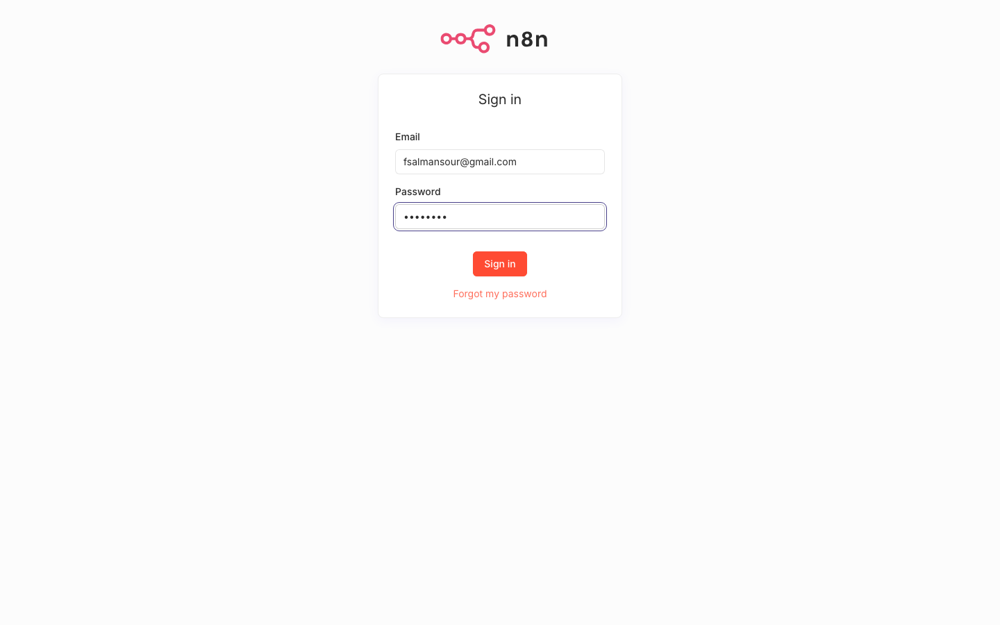
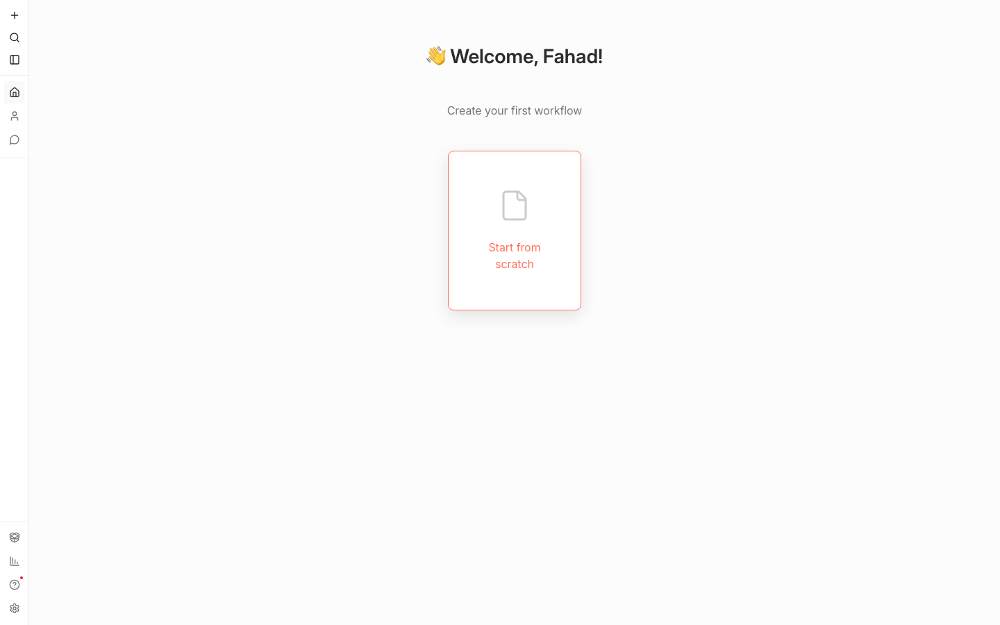
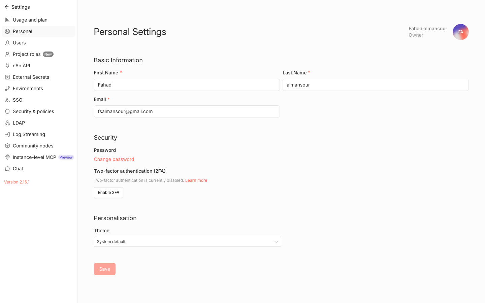
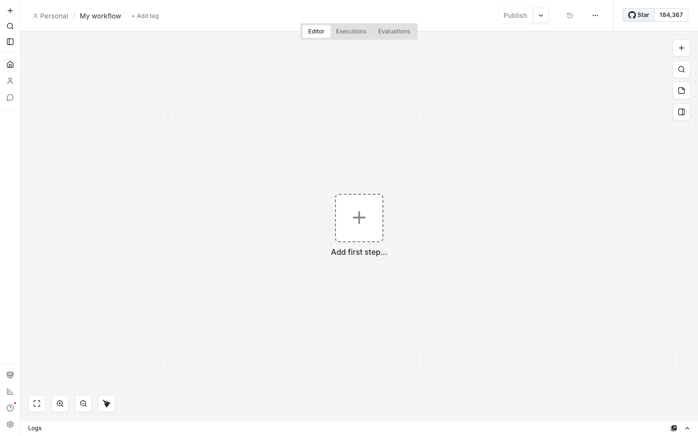
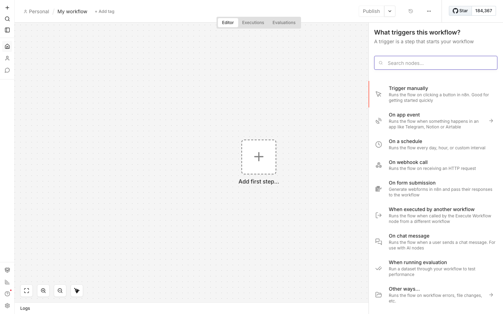

# n8n NeoGen — Full Beginner Guide
> Last updated: April 2026
> Server: https://n8n.neogen.store (CT 119 on pve1)

This guide takes you from zero to running 6 real automations for NeoGen Store. Read it top to bottom the first time, then come back to specific workflows later.

---

## Table of Contents

- [Part 1 — Your First 10 Minutes](#part-1--your-first-10-minutes)
- [Part 2 — The Foundations: Credentials](#part-2--the-foundations-credentials)
- [Part 3 — Workflow #1: Gift Card Auto-Delivery ⭐](#part-3--workflow-1-gift-card-auto-delivery)
- [Part 4 — Workflow #2: New Order WhatsApp Alert](#part-4--workflow-2-new-order-whatsapp-alert)
- [Part 5 — Workflow #3: Abandoned Cart Recovery](#part-5--workflow-3-abandoned-cart-recovery)
- [Part 6 — Workflow #4: Daily AliExpress Price Sync](#part-6--workflow-4-daily-aliexpress-price-sync)
- [Part 7 — Workflow #5: Service Request → WhatsApp + Sheet](#part-7--workflow-5-service-request--whatsapp--sheet)
- [Part 8 — Workflow #6: Dropship Orders → DSers](#part-8--workflow-6-dropship-orders--dsers)
- [Part 9 — Troubleshooting](#part-9--troubleshooting)

---

## Part 1 — Your First 10 Minutes

### Step 1.1: Sign in
Open: **https://n8n.neogen.store**

You'll see the sign-in screen:



Log in with:
- Email: `fsalmansour@gmail.com`
- Password: `Fhd@1993`

### Step 1.2: Your landing page

After login you'll see this welcome screen:



**Left sidebar (top to bottom):**
- ➕ **Plus** — quick create workflow/credential
- 🔍 **Search** — find workflows/credentials
- 📋 **Sidebar toggle** — expand menu labels
- 🏠 **Home** — overview (where you are now)
- 👤 **Personal** — your private workflows
- 💬 **Chat** — n8n AI chat (optional)

**Left sidebar (bottom):**
- 📦 **Templates** — pre-built workflows
- 📊 **Insights** — execution stats
- ❓ **Help** — docs + community
- ⚙️ **Settings** — account, API, users, logs

### Step 1.3: Understand three n8n concepts

| Concept | What it is | Example |
|---------|-----------|---------|
| **Workflow** | A sequence of steps (your automation) | "Send gift card after purchase" |
| **Node** | One step inside a workflow | "Send email via SMTP" |
| **Credential** | A saved login for an external service | "My WooCommerce API keys" |

Every automation = **Workflow** made of **Nodes**. Nodes use **Credentials** to talk to services.

### Step 1.4: Make the UI comfortable

Go to **Settings → Personal** (bottom gear icon → Personal).



Recommended changes:
- **Theme**: Dark (easier on eyes)
- **Time Zone**: Asia/Riyadh (already set by us)
- **Language**: English (Arabic interface for n8n isn't great yet)

Click **Save**.

---

## Part 2 — The Foundations: Credentials

You'll set up 5 credentials **once**. Every workflow uses them.

### Step 2.1: Open Credentials

Click **Home** in the left sidebar, then click the **Credentials** tab:


Click **Add first credential** (or the **Create credential** button top-right).

---

### Credential A — WooCommerce (your store)

This lets n8n read orders from neogen.store and update them.

1. Click **Create credential** → search **WooCommerce** → select **WooCommerce API**
2. Fill in:
   - **Credential name**: `NeoGen WooCommerce`
   - **Consumer Key**: `ck_773d963e520e33aeee2ae5b88bb18bad54205afd`
   - **Consumer Secret**: `cs_d8e0323962b28967644d0246c07de84e2b4631bc`
   - **URL**: `https://neogen.store`
   - **Include Credentials on Refresh-Only**: leave unchecked
3. Click **Save**
4. You'll see a green "Connection tested successfully" — if red, double-check the URL has no trailing slash

> These keys were generated specifically for n8n when we set up the server. They're also saved in Bitwarden under "n8n → WooCommerce API (neogen.store)".

---

### Credential B — SMTP (for sending emails)

This uses Gmail's SMTP (easiest, 500/day free).

**Before you start:** create a Gmail App Password:
1. Go to https://myaccount.google.com/apppasswords
2. Create a new app password named "n8n"
3. Copy the 16-character password (looks like `xxxx xxxx xxxx xxxx`)

Then in n8n:
1. **Create credential** → search **SMTP** → **SMTP**
2. Fill in:
   - **Credential name**: `Gmail SMTP`
   - **User**: your Gmail address (e.g. `fsalmansour@gmail.com`)
   - **Password**: the 16-char app password from above (no spaces)
   - **Host**: `smtp.gmail.com`
   - **Port**: `465`
   - **SSL/TLS**: ✅ checked
3. Click **Save**

> If you prefer a professional email (`noreply@neogen.store`), use your WP Mail SMTP plugin's existing provider — ask for the SMTP host/user/pass from your WP admin.

---

### Credential C — Google Sheets (for gift card stock)

1. **Create credential** → **Google Sheets** → **Google Sheets OAuth2 API**
2. Click **Sign in with Google** — authorize with `fsalmansour@gmail.com`
3. Click **Save**

> n8n will store the OAuth token. You won't need to do this again.

---

### Credential D — Telegram (for order notifications)

1. Open Telegram, search `@BotFather`, send `/newbot`, answer the prompts
2. BotFather gives you a token like `7891234567:AAEabc...xyz`
3. Send `/start` to your new bot (find it by the username BotFather gave you)
4. Visit `https://api.telegram.org/bot<YOUR_TOKEN>/getUpdates` in your browser — you'll see your chat ID inside `"chat":{"id":123456789`
5. In n8n: **Create credential** → **Telegram API** → paste the token, save.

You'll hardcode the chat ID inside the workflow later.

---

### Credential E — WhatsApp (via Green API)

Skip this for now — we'll cover it in Workflow #5. Green API needs a phone scan and takes 10 minutes to set up.

---

## Part 3 — Workflow #1: Gift Card Auto-Delivery

**What it does:**
```
Customer buys gift card on neogen.store
   ↓
n8n detects the order
   ↓
Gets next unused code from Google Sheet
   ↓
Emails code to customer
   ↓
Marks row as "used" + order as "completed"
```

### Step 3.1: Create the Google Sheet

1. Go to https://sheets.new
2. Name it: **NeoGen Gift Card Stock**
3. Create these columns in row 1:

| SKU | Code | Used | UsedAt | OrderID | Email |
|-----|------|------|--------|---------|-------|

4. Add some test rows:

| SKU | Code | Used |
|-----|------|------|
| GC-STM-50 | STEAM-ABCD-1234-EFGH | FALSE |
| GC-STM-50 | STEAM-WXYZ-5678-MNOP | FALSE |
| GC-SW-WIN11 | WIN11-PRO-AAAA-BBBB | FALSE |

5. Copy the sheet URL (you'll need it)

### Step 3.2: Create the workflow

In n8n: click **Start from scratch** on the Home page.



Rename the workflow: click **"My workflow"** at the top-left → type `Gift Card Auto-Delivery` → Enter.

### Step 3.3: Add the trigger

Click the big **+ Add first step** in the center.



From the panel on the right:
1. Click **On app event**
2. Search: `WooCommerce`
3. Select: **WooCommerce Trigger**
4. In the node config:
   - **Credential**: select `NeoGen WooCommerce`
   - **Trigger on**: `Order Created`
5. Click the **Listen for event** button at the top of the node
6. n8n shows a URL — ignore this for now, click the **Back to canvas** arrow

The workflow will auto-register a webhook in WooCommerce when you activate it later.

### Step 3.4: Filter — only gift card orders

Click the **+** to the right of the WooCommerce Trigger node.

1. Search: `Filter` → select **Filter** (core node, blue icon)
2. In the Conditions block:
   - **Left**: click the "fx" and type `{{ $json.line_items[0].sku }}` (drag from left panel: Input → line_items → 0 → sku)
   - **Operation**: `starts with`
   - **Right**: `GC-`
3. Click **Back to canvas**

> `GC-` is the prefix for all gift card SKUs.

### Step 3.5: Look up code in Google Sheet

Click **+** after Filter:
1. Search: `Google Sheets` → **Google Sheets**
2. **Credential**: Google Sheets OAuth2 API (the one you created)
3. **Resource**: `Sheet Within Document`
4. **Operation**: `Get Row(s) in Sheet`
5. **Document**: pick your "NeoGen Gift Card Stock" from dropdown
6. **Sheet**: `Sheet1`
7. **Filters**:
   - Column: `SKU` = `{{ $('WooCommerce Trigger').item.json.line_items[0].sku }}`
   - Column: `Used` = `FALSE`
8. **Limit**: `1`
9. Click **Execute step**

This returns ONE unused code matching the SKU.

### Step 3.6: Send email to customer

Click **+** after Google Sheets:
1. Search: `Send Email` → **Send Email** (SMTP-based)
2. **Credential**: `Gmail SMTP`
3. **From**: `NeoGen Store <fsalmansour@gmail.com>`
4. **To**: `{{ $('WooCommerce Trigger').item.json.billing.email }}`
5. **Subject**: `طلبك جاهز — كود المنتج الرقمي | NeoGen Store`
6. **HTML**: (switch to HTML tab)

```html
<div dir="rtl" style="font-family:Cairo,Arial;padding:24px;background:#0A0A0B;color:#fff;">
<h2 style="color:#0066FF">شكراً لشرائك من NeoGen Store ⚡</h2>
<p>مرحباً {{ $('WooCommerce Trigger').item.json.billing.first_name }}،</p>
<p>تم تأكيد طلبك رقم <b>#{{ $('WooCommerce Trigger').item.json.id }}</b>. هذا هو كود المنتج الرقمي:</p>
<div style="background:#1C1C1E;border:1px solid #FFCC00;border-radius:12px;padding:20px;margin:20px 0;font-family:JetBrains Mono,monospace;font-size:18px;text-align:center;letter-spacing:2px;color:#FFCC00">
{{ $json.Code }}
</div>
<p style="color:#98989D;font-size:14px">احتفظ بالكود في مكان آمن. بعد كشف/استخدام الكود لا يمكن إرجاعه.</p>
<p>للدعم، واتساب: <a href="https://wa.me/966570131122" style="color:#0066FF">0570 131 122</a></p>
<hr style="border-color:#222">
<p style="font-size:12px;color:#636366">NeoGen Store · جيل التقنية القادم · CR 7053130576</p>
</div>
```

7. Click **Save**

### Step 3.7: Mark the code as "used" in the sheet

Click **+** after Send Email:
1. Search: `Google Sheets` → **Google Sheets**
2. **Operation**: `Update Row`
3. **Document** + **Sheet**: same as before
4. **Matching Column**: `Code`
5. **Values to Send**:
   - `Used` = `TRUE`
   - `UsedAt` = `{{ $now.toISO() }}`
   - `OrderID` = `{{ $('WooCommerce Trigger').item.json.id }}`
   - `Email` = `{{ $('WooCommerce Trigger').item.json.billing.email }}`
6. **Save**

### Step 3.8: Mark the order as "completed"

Click **+** after the Google Sheets Update:
1. Search: `WooCommerce` → **WooCommerce** (the non-trigger one, action node)
2. **Credential**: `NeoGen WooCommerce`
3. **Resource**: `Order`
4. **Operation**: `Update`
5. **Order ID**: `{{ $('WooCommerce Trigger').item.json.id }}`
6. **Update Fields** → add:
   - `Status` = `completed`
   - `Customer Note` = `Digital code delivered automatically via n8n`
7. **Save**

### Step 3.9: Activate the workflow

Top-right of the canvas, click the grey **Inactive** toggle — it turns green and says **Active**.

You'll see a confirmation: "Webhook has been registered in WooCommerce".

### Step 3.10: Test it

1. Place a test order on neogen.store using a gift card product. Pay (or mark as paid manually in WP admin if you don't want to actually pay).
2. Within 2–5 seconds, n8n will:
   - Fire the workflow
   - Pick a code from the sheet
   - Email the customer
   - Mark the code used
   - Complete the order
3. Check your email inbox + the Google Sheet.

**Verification**: Go to **Executions** tab in n8n — you'll see a green "Success" run.

---

## Part 4 — Workflow #2: New Order WhatsApp Alert

**What it does**: Sends YOU a Telegram message on every new order (so you know to ship it).

### Steps

1. New workflow: `Order Alerts`
2. **Trigger**: WooCommerce Trigger → Order Created
3. **Action**: Telegram → Send Message
   - **Credential**: Telegram API
   - **Chat ID**: your personal chat ID from Part 2D
   - **Text**:
   ```
   🛒 طلب جديد #{{ $json.id }}
   👤 {{ $json.billing.first_name }} {{ $json.billing.last_name }}
   📦 {{ $json.line_items.length }} منتج
   💵 {{ $json.total }} {{ $json.currency }}
   📍 {{ $json.shipping.city }}
   ☎️ {{ $json.billing.phone }}
   🔗 https://neogen.store/wp-admin/post.php?post={{ $json.id }}&action=edit
   ```
4. **Activate**. Done — 3 nodes total.

---

## Part 5 — Workflow #3: Abandoned Cart Recovery

**What it does**: If a customer started checkout but didn't pay within 1 hour, email them a reminder.

> Requires **WooCommerce Abandoned Cart Lite** plugin installed (free). It logs abandoned carts.

1. New workflow: `Abandoned Cart Recovery`
2. **Trigger**: Schedule Trigger → `Every 30 minutes`
3. **HTTP Request** node → GET `https://neogen.store/wp-json/wc/v3/orders?status=on-hold,pending&after={{ $now.minus({hours:2}).toISO() }}&before={{ $now.minus({hours:1}).toISO() }}` with WooCommerce credential
4. **Filter** node: only items where `billing.email` is not empty
5. **Send Email** node:
   - **Subject**: `نسيت سلتك؟ خلها لا تفوتك 🛒`
   - HTML email with their cart items and a link back to `https://neogen.store/checkout/`
6. Activate.

---

## Part 6 — Workflow #4: Daily AliExpress Price Sync

**What it does**: Once a day, reads your AliExpress price CSV (the one we built at `/Users/fahadalmansour/ngs/neogen_aliexpress_mapping.csv`) and updates WooCommerce prices using the markup rules.

1. Upload that CSV to Google Sheets (same account as gift cards)
2. New workflow: `Daily Price Sync`
3. **Trigger**: Schedule Trigger → `Every day at 03:00 Asia/Riyadh`
4. **Google Sheets** → Read all rows from AliExpress price sheet
5. **Function** node (JavaScript):
   ```javascript
   const USD_TO_SAR = 3.75;
   const tiers = [[10,2.5,20],[30,2.0,25],[100,1.8,30],[300,1.6,40],[1000,1.5,50],[99999,1.35,100]];
   return items.map(item => {
     const cost = parseFloat(item.json.aliexpress_price_usd);
     if (!cost) return null;
     const tier = tiers.find(t => cost <= t[0]);
     const raw = (cost * USD_TO_SAR * tier[1]) + tier[2];
     const newPrice = Math.ceil(raw / 10) * 10 - 1;
     return { json: { id: item.json.wc_id, regular_price: String(Math.ceil(newPrice*1.12/10)*10 - 1), sale_price: String(newPrice) } };
   }).filter(Boolean);
   ```
6. **HTTP Request** (batch update) → POST `https://neogen.store/wp-json/wc/v3/products/batch` with body `{"update": <items from previous node>}`, auth=WooCommerce credential.
7. **Telegram** → notify you "Synced X prices".
8. Activate.

---

## Part 7 — Workflow #5: Service Request → WhatsApp + Sheet

Currently your "Preconfigured Services" section sends directly to WhatsApp. This workflow adds: log each request to a Google Sheet for tracking.

1. Change the form action on neogen.store from `https://wa.me/...` to a webhook (I can help you do this)
2. New workflow: `Service Requests`
3. **Trigger**: Webhook → copy the generated URL → put it in the form's action
4. **Google Sheets** → Append Row (name, phone, service type, details, timestamp)
5. **Telegram** → notify you
6. **HTTP Response** → redirect customer to WhatsApp with the filled text
7. Activate.

---

## Part 8 — Workflow #6: Dropship Orders → DSers

For physical products, auto-forward the order to DSers which places the AliExpress order.

1. DSers doesn't have a direct API — use their Chrome extension OR the WooCommerce webhook they provide
2. Easier path: DSers **already** auto-polls your store if you connected it. This workflow just adds a Telegram notification when DSers successfully fulfills.
3. **Trigger**: WooCommerce Trigger → Order Updated, filter status = `processing` + product SKU doesn't start with `GC-`
4. **HTTP Request** (optional): call DSers API if you upgrade to their paid plan
5. **Telegram** → notify you the order was forwarded

---

## Part 9 — Troubleshooting

### Workflow doesn't fire
- Check the workflow is **Active** (top-right toggle green)
- Check **Executions** tab — does it show the run?
- For WooCommerce triggers: go to WP admin → WooCommerce → Settings → Advanced → Webhooks → confirm webhook exists and is "Active"

### Email didn't send
- Check the Send Email node's execution output (click the node, see right panel)
- Gmail blocks "less secure" — make sure you used an App Password, not your regular Gmail password
- Check Gmail "Sent" folder — did it send but land in customer's spam?

### "Invalid credential" error
- Open Credentials tab, click the credential, click **Test** button
- For WooCommerce: double-check URL has no trailing slash, keys are the full `ck_...`/`cs_...`

### Google Sheet returns nothing
- In the sheet, "Used" column must be the text `FALSE` (uppercase), not `false`
- Make sure you have at least one row matching the SKU with `Used=FALSE`

### "Workflow timed out"
- Default timeout is 300s, mostly fine. If hitting: Settings → n8n API → increase `EXECUTIONS_TIMEOUT`

---

## Reference — Your Credentials (from Bitwarden)

| Service | Where to find | Used by |
|---------|--------------|---------|
| n8n login | `n8n NeoGen` in Bitwarden | You |
| WooCommerce API | `n8n → WooCommerce API (neogen.store)` in Bitwarden | All workflows |
| Gmail SMTP | create app-password via myaccount.google.com | Email sends |
| Google Sheets | OAuth — sign in once | Gift cards, price sync |
| Telegram Bot | @BotFather → save token in Bitwarden | Alerts |

---

## What's Next?

After Workflow #1 works:
1. Move on to #2 (easiest win — 3 nodes)
2. Then #4 (price sync — reuses your existing CSV)
3. Then #3, #5, #6 in any order

**When you get stuck on any node:**
- Click the node → right panel shows input/output data
- Click **Execute step** on a single node to test it in isolation
- Use the **Executions** tab to see full trace of every run

If you need more screenshots for a specific node, tell me which workflow + which step and I'll capture it.
